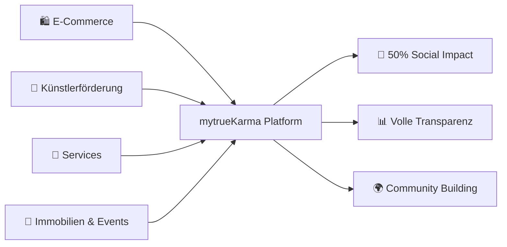

# 🌟 mytrueKarma Wiki

### Social Commerce Platform für nachhaltigen & transparenten Handel

---

**мүтʀueᴋaʀᴍa EST. 2021** - Eine innovative Social Commerce Platform mit Fokus auf soziale Projekte, Künstlerförderung und transparenten Handel.

---

## 📚 Wiki Navigation

<table>
<tr>
<td width="33%" align="center">
<h3>🚀 Getting Started</h3>

 
<small>Setup & lokale Entwicklung</small>
</td>
<td width="33%" align="center">
<h3>🏗️ Architektur</h3>

 
<small>Tech Stack & Design Patterns</small>
</td>
<td width="33%" align="center">
<h3>✨ Features</h3>

 
<small>Alle Plattform-Features im Detail</small>
</td>
</tr>
<tr>
<td width="33%" align="center">
<h3>🗄️ Datenbank</h3>

 
<small>Tabellen, RLS & Migration</small>
</td>
<td width="33%" align="center">
<h3>🎨 UI/UX Guide</h3>

 
<small>Components, Colors & Styles</small>
</td>
<td width="33%" align="center">
<h3>📖 API Docs</h3>

 
<small>Endpoints & Integration</small>
</td>
</tr>
<tr>
<td width="33%" align="center">
<h3>🛒 Product System</h3>

 
<small>Dynamisches Produktmanagement</small>
</td>
<td width="33%" align="center">
<h3>🔐 Authentication</h3>

 
<small>Login, OAuth & Session</small>
</td>
<td width="33%" align="center">
<h3>🚀 Deployment</h3>

 
<small>CI/CD & Production Setup</small>
</td>
</tr>
</table>

---

## 🎯 Projekt-Übersicht

### Was ist mytrueKarma?

mytrueKarma ist eine **umfassende Social Commerce Platform**, die nachhaltigen Handel, Transparenz und soziales Engagement miteinander verbindet. Die Plattform bietet:

### 🌱 Mission Statement

> **Wir glauben an nachhaltigen Handel, der nicht nur Profit generiert, sondern auch positive soziale Auswirkungen schafft.**

Bei mytrueKarma fließen **50% unserer Erlöse** in soziale Projekte. Jede Transaktion wird transparent veröffentlicht und trägt zu einer besseren Welt bei.

---

## 📊 Quick Stats

| Kategorie | Anzahl | Status |
|-----------|--------|--------|
| 📦 **Produkttypen** | 4 | ✅ Live |
| ��️ **Standard Produkte** | 6+ | ✅ Live |
| 🎉 **Events** | 8+ | ✅ Live |
| 🏠 **Immobilien** | 6+ | ✅ Live |
| 💼 **Services** | 4+ | ✅ Live |
| 🎨 **Featured Artists** | 2+ | ✅ Live |
| 🌳 **Spendenprojekte** | 2+ | ✅ Live |
| 👥 **Community Members** | 50+ | 📈 Growing |

---

## 🛠️ Tech Stack Highlights

### Frontend

### Backend & Database

### UI & Components

### Deployment

---

## 🗺️ Roadmap

### ✅ Phase 1 - Foundation (Abgeschlossen)

- [x] Grundlegende E-Commerce Funktionalität
- [x] Responsive Design Implementation
- [x] Dynamisches Produktsystem (4 Typen)
- [x] Seller Dashboard & Admin Interface
- [x] Events & Immobilien Integration
- [x] Services Marketplace
- [x] Künstlerförderung Features
- [x] WhatsApp Integration

### 🚀 Phase 2 - Backend & Auth (In Arbeit)

- [x] Supabase Setup & Configuration
- [x] NextAuth.js Integration (Credentials + OAuth)
- [x] Datenbank Schema Design (8 Tabellen)
- [x] Row Level Security (RLS) Policies
- [ ] **→ SQL Schema ausführen** (Nächster Schritt)
- [ ] localStorage → Supabase Migration
- [ ] Real-time Features

### 📅 Phase 3 - Payment & Communication (Geplant)

- [ ] Stripe/PayPal Integration
- [ ] Real-time Chat System
- [ ] Email Notifications
- [ ] SMS Benachrichtigungen
- [ ] Advanced Review System

### 🔮 Phase 4+ - Advanced Features (Zukunft)

- [ ] AI-powered Recommendations
- [ ] Multi-language Support (i18n)
- [ ] Mobile App (React Native)
- [ ] NFT & Blockchain Integration

---

## 🤝 Contributing

Wir freuen uns über Beiträge! Siehe [Contributing Guide](Contributing) für Details.

---

## 📞 Kontakt & Support

### mytrueKarma Team

**Adresse:** Aufm Hennekamp 96, 40225 Düsseldorf  
**Öffnungszeiten:** Mo – Fr: 9:30 – 18:00

---

## 📄 Lizenz

**Creative Commons Attribution-NonCommercial-NoDerivatives 4.0 International**

---

**Made with ❤️ in Düsseldorf** | **COPYRIGHT 2024 © mytrueKarma**

> Ein Projekt für nachhaltigen und transparenten Handel

