# Working with Pull Requests and Branches

When collaborating on a project, pull requests (PRs) are a crucial part of the workflow. They allow team members to propose changes, review code, and discuss improvements before merging them into the main codebase.

## Understanding Branches

Branches are separate lines of development that allow you to work on features, fixes, or experiments without affecting the main codebase. Think of them as parallel universes where you can make changes safely.

### Initial Repository State

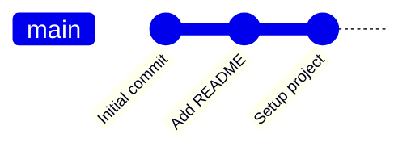

## Creating a Feature Branch

When you want to work on a new feature, you create a branch from the main branch (usually `main` or `master`).

**Commands:**
```bash
git checkout main
git pull origin main
git checkout -b feature/new-feature
```

### Repository After Branch Creation

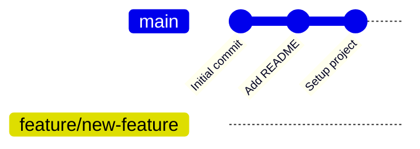

## Making Changes on Your Branch

You work on your feature branch, making commits as you progress.

**Commands:**
```bash
git add .
git commit -m "Add new feature functionality"
git commit -m "Add tests for new feature"
git commit -m "Update documentation"
```

### Repository with Feature Development

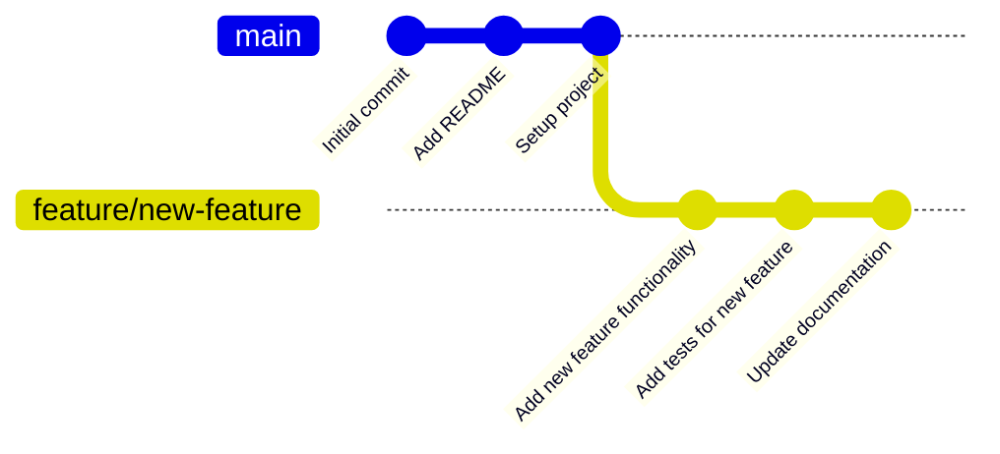

## Pushing Your Branch

Once you're ready to share your work, push your branch to the remote repository.

**Commands:**
```bash
git push origin feature/new-feature
```

## Creating a Pull Request

After pushing your branch, you create a pull request (PR) on GitHub/GitLab/Bitbucket. This is done through the web interface.

**A PR includes:**
- Title and description of changes
- Link to related issues
- List of changes made
- Screenshots (if UI changes)
- Testing instructions

## Meanwhile, on Main Branch...

While you're working on your feature, other developers might merge their changes to the main branch.

### Repository with Parallel Development

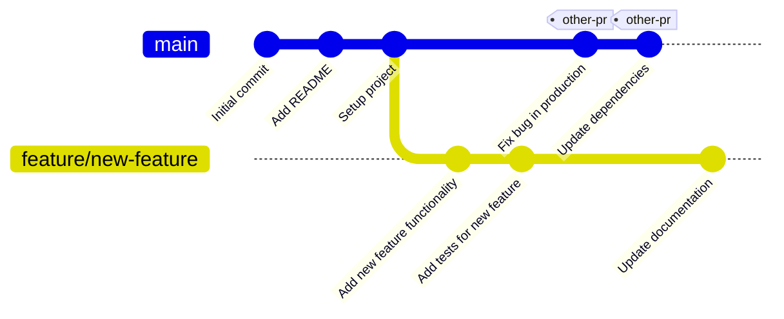

## Keeping Your Branch Updated

To avoid conflicts, regularly update your branch with changes from main.

**Commands:**
```bash
git checkout main
git pull origin main
git checkout feature/new-feature
git merge main
# or use rebase:
# git rebase main
```

### Repository After Updating Branch

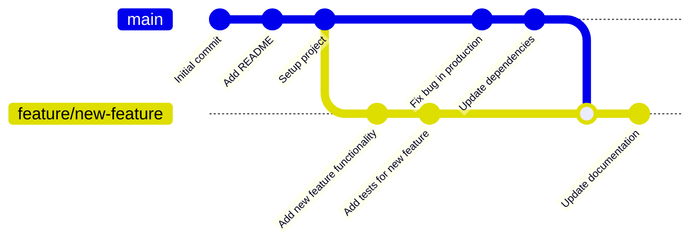

## Code Review Process

Team members review your PR:

1. **Reviewers check:**
   - Code quality and style
   - Test coverage
   - Documentation
   - Potential bugs or issues
   - Performance implications

2. **Feedback cycle:**
   - Reviewers leave comments
   - You make requested changes
   - Push new commits to the same branch
   - Reviewers re-review

**Commands for addressing feedback:**
```bash
git add .
git commit -m "Address review feedback: refactor helper function"
git push origin feature/new-feature
```

### Repository with Review Feedback

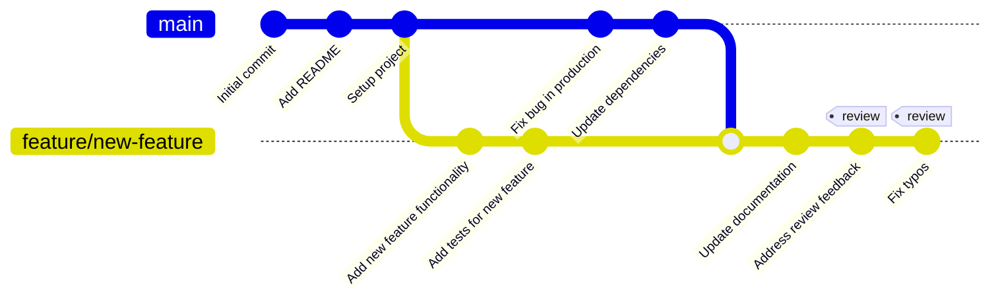

## Merging the Pull Request

Once approved, the PR is merged into the main branch. There are several merge strategies:

### 1. Merge Commit (Default)

Creates a merge commit that preserves the full history.

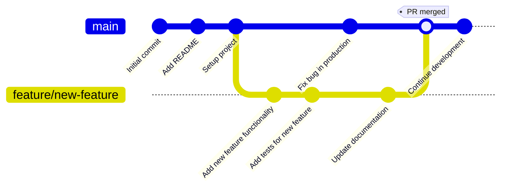

### 2. Squash and Merge

Combines all commits into a single commit on main.

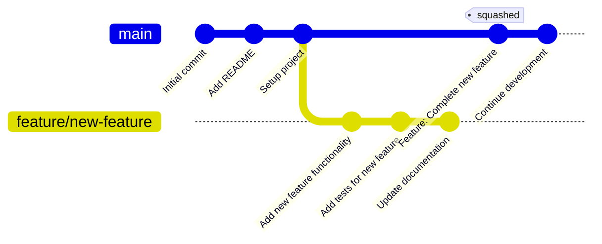

### 3. Rebase and Merge

Replays commits on top of main, creating a linear history.

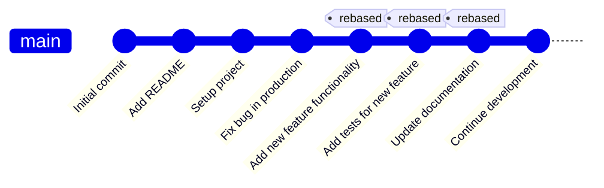

## Cleaning Up

After merging, delete the feature branch to keep the repository tidy.

**Commands:**
```bash
git checkout main
git pull origin main
git branch -d feature/new-feature  # Delete local branch
git push origin --delete feature/new-feature  # Delete remote branch
```

## Common Workflows

### GitHub Flow

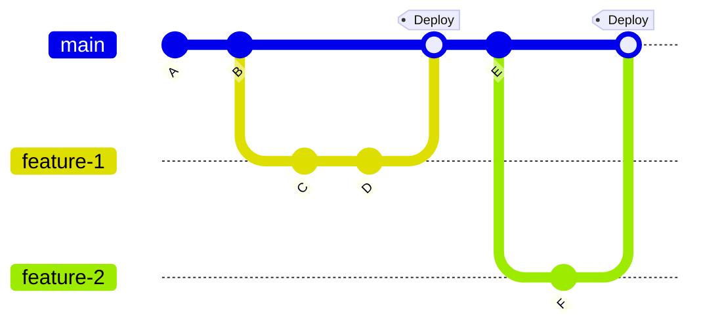

### Git Flow

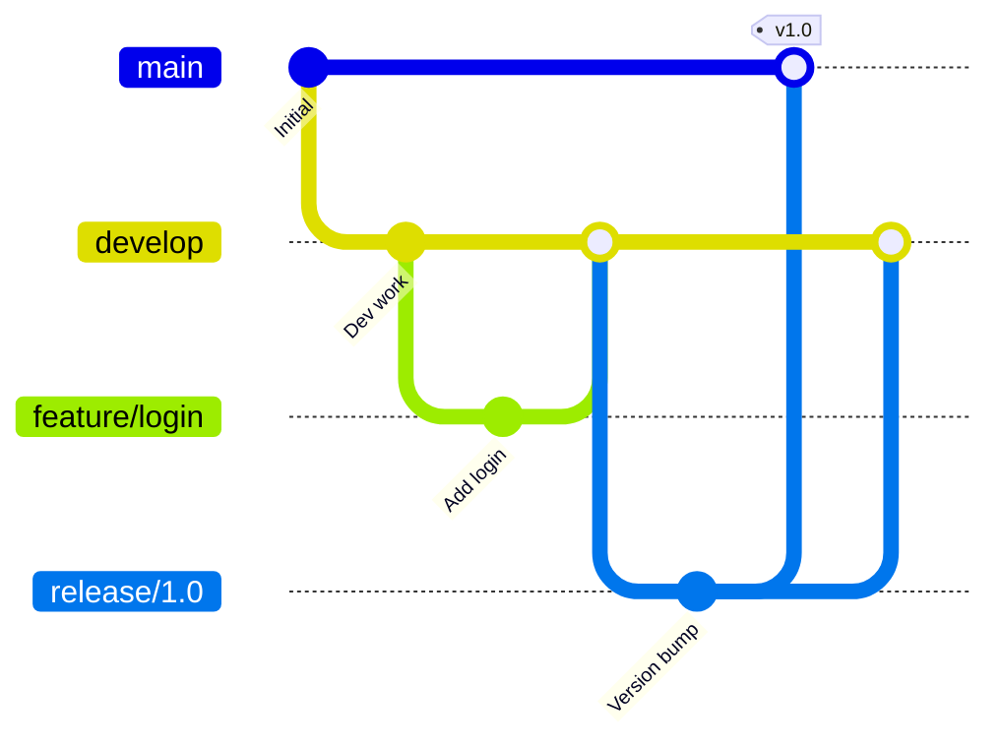

## Best Practices

### Branch Naming Conventions

- `feature/description` - New features
- `bugfix/description` - Bug fixes
- `hotfix/description` - Urgent production fixes
- `refactor/description` - Code refactoring
- `docs/description` - Documentation updates

### Commit Message Guidelines

```bash
# Good commit messages
git commit -m "Add user authentication with JWT"
git commit -m "Fix memory leak in image processing"
git commit -m "Refactor database connection logic"

# Bad commit messages
git commit -m "fix stuff"
git commit -m "WIP"
git commit -m "asdfasdf"
```

### Pull Request Tips

1. **Keep PRs small** - Easier to review, faster to merge
2. **Write clear descriptions** - Explain what and why
3. **Link related issues** - Use "Closes #123" or "Fixes #456"
4. **Add screenshots** - For UI changes
5. **Test thoroughly** - Before requesting review
6. **Respond to feedback** - Be open to suggestions
7. **Keep it updated** - Merge main regularly

## Handling Conflicts

When branches diverge too much, conflicts can occur.

### Conflict Scenario

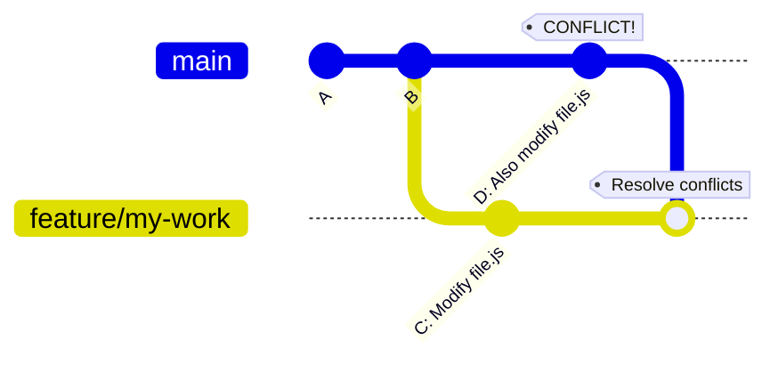

**Resolving conflicts:**
```bash
git checkout feature/my-work
git merge main
# Git will notify you of conflicts
# Edit conflicted files
git add .
git commit -m "Resolve merge conflicts"
git push origin feature/my-work
```

## Advanced: Multiple Features

Working on multiple features simultaneously.

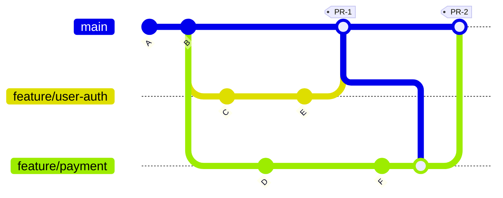

## Summary

The pull request workflow:

1. **Create a branch** from main
2. **Make changes** and commit them
3. **Push** the branch to remote
4. **Open a pull request**
5. **Code review** and discussion
6. **Address feedback** with new commits
7. **Merge** when approved
8. **Delete** the branch
9. **Pull** the updated main

This workflow ensures code quality, facilitates collaboration, and maintains a clean project history.

